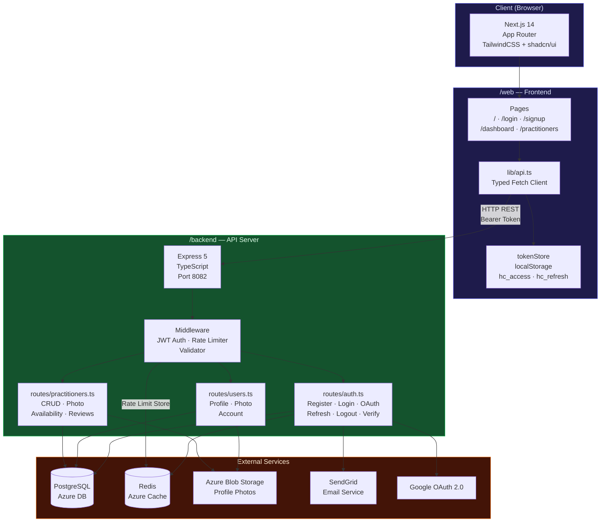
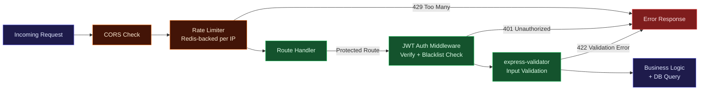

# HealConnect

<p align="center">
  
</p>

> A professional wellness platform connecting users with verified energy healers, Vastu experts, numerologists, and tarot readers — instantly.

---

## Architecture Overview



---

## Authentication Flow

```mermaid
sequenceDiagram
    autonumber
    participant U as User
    participant FE as Frontend
    participant API as Backend API
    participant DB as PostgreSQL
    participant RD as Redis
    participant SG as SendGrid

    rect rgb(30, 27, 75)
        Note over U,SG: Registration Flow
        U->>FE: Fill signup form
        FE->>API: POST /api/auth/register
        API->>DB: Check email uniqueness
        API->>DB: Create user (bcrypt hash)
        API->>SG: Send verification email
        API->>DB: Store refresh token
        API-->>FE: accessToken (15m) + refreshToken (7d)
        FE->>FE: Store tokens in localStorage
    end

    rect rgb(20, 83, 45)
        Note over U,SG: Login Flow
        U->>FE: Enter credentials
        FE->>API: POST /api/auth/login
        API->>DB: Find user by email
        API->>API: bcrypt.compare password
        API->>DB: Store new refresh token
        API-->>FE: accessToken + refreshToken
    end

    rect rgb(67, 20, 7)
        Note over U,SG: Token Refresh Flow
        FE->>API: POST /api/auth/refresh
        API->>DB: Validate refresh token (not revoked/expired)
        API->>DB: Revoke old refresh token
        API->>DB: Issue new refresh token
        API-->>FE: New accessToken + refreshToken
    end

    rect rgb(67, 20, 7)
        Note over U,SG: Logout Flow
        FE->>API: POST /api/auth/logout
        API->>DB: Revoke refresh token
        API->>RD: Blacklist access token (TTL = remaining expiry)
        API-->>FE: 200 OK
    end
```



---

## Request Lifecycle



---

## Database Schema

```mermaid
erDiagram
    style User fill:#1e1b4b
    style Practitioner fill:#14532d
    style Session fill:#431407

    User {
        uuid id PK
        string email UK
        string phone UK
        string name
        string passwordHash
        string provider
        string googleId UK
        string appleId UK
        string birthPlace
        string gender
        string[] wellnessInterests
        string photoUrl
        bool isEmailVerified
        datetime createdAt
    }

    Practitioner {
        uuid id PK
        string email UK
        string name
        string bio
        string[] specialties
        string[] certifications
        string[] languages
        int experienceYrs
        float perMinuteRate
        string photoUrl
        bool isVerified
        bool isOnline
    }

    RefreshToken {
        uuid id PK
        uuid userId FK
        string token UK
        bool isRevoked
        datetime expiresAt
    }

    Wallet {
        uuid id PK
        uuid userId FK
        float balance
        string currency
    }

    Transaction {
        uuid id PK
        uuid walletId FK
        float amount
        string type
        string status
        string referenceId
    }

    Session {
        uuid id PK
        uuid userId FK
        uuid practitionerId FK
        string type
        string status
        float totalCost
        datetime startTime
        datetime endTime
    }

    Review {
        uuid id PK
        uuid sessionId FK
        uuid userId FK
        uuid practitionerId FK
        int rating
        string comment
    }

    User ||--o{ RefreshToken : "has"
    User ||--o| Wallet : "has"
    User ||--o{ Session : "books"
    User ||--o{ Review : "writes"
    Wallet ||--o{ Transaction : "has"
    Practitioner ||--o{ Session : "conducts"
    Practitioner ||--o{ Review : "receives"
    Session ||--o| Review : "has"
```



---

## Monorepo Structure

```
Heal_Connect/
├── backend/          # Node.js + Express + Prisma API
│   ├── src/
│   ├── prisma/
│   └── README.md     # Backend docs
├── web/              # Next.js 14 frontend
│   ├── src/
│   └── README.md     # Frontend docs
├── docs/             # Project documentation & assets
│   ├── logo.png                    # Project logo
│   ├── tech_stack_review.md        # Tech stack analysis & risks
│   ├── HealConnect_Project_Plan.xlsx
│   ├── HealConnect_Tech_Stack.docx
│   └── AstroTalk_Analysis.pptx
└── README.md         # This file
```

---

## Quick Start

### 1. Backend
```bash
cd backend
npm install
npx prisma generate
npx prisma db push
npm run dev
# → http://localhost:8082
```

### 2. Frontend
```bash
cd web
npm install
npm run dev
# → http://localhost:3000
```

### Environment Files
- `backend/.env` — `DATABASE_URL`, `JWT_*`, `REDIS_URL`, `SENDGRID_*`, `GOOGLE_CLIENT_ID`
- `web/.env` — `NEXT_PUBLIC_API_URL`, `NEXT_PUBLIC_GOOGLE_CLIENT_ID`

---

## Features

- JWT auth with access/refresh token rotation and Redis blacklisting
- Google & Apple OAuth sign-in
- Email verification and password reset via SendGrid
- Redis-backed rate limiting per IP (general + auth + email tiers)
- User profiles with photo upload to Azure Blob Storage
- Practitioner directory with search, filter, ratings, and availability
- Light / Dark mode with smooth transitions
- Mobile-responsive UI built with TailwindCSS + shadcn/ui
