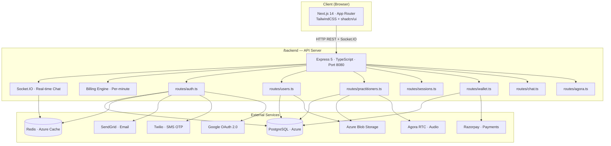
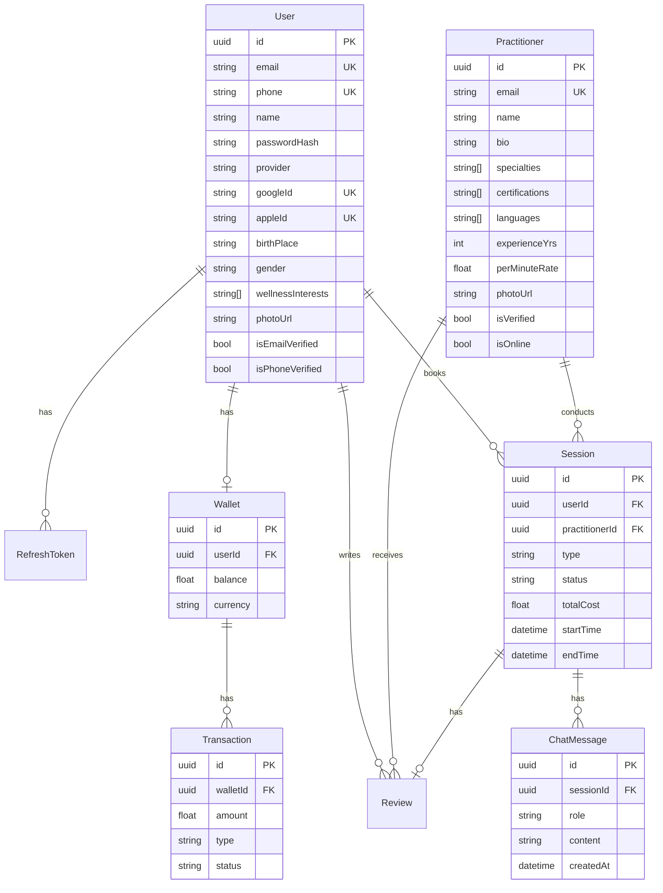

<div align="center">


<h1>🌿 HealConnect — Wellness Platform</h1>

<p align="center">


</p>

> A production-ready full-stack wellness platform connecting users with verified energy healers, Vastu experts, numerologists, and tarot readers — instantly.

</div>

---

## 📁 Project Structure

```
HealConnect/
├── backend/                          # Node.js + Express 5 + Prisma API
│   ├── prisma/
│   │   ├── schema.prisma
│   │   └── migrations/
│   ├── src/
│   │   ├── index.ts                  # Entry point (Port 8080)
│   │   ├── lib/
│   │   │   ├── prisma.ts
│   │   │   ├── jwt.ts
│   │   │   ├── redis.ts
│   │   │   ├── azure.ts
│   │   │   ├── email.ts
│   │   │   ├── sms.ts
│   │   │   └── socket.ts             # Socket.IO server
│   │   ├── middleware/
│   │   │   ├── auth.ts
│   │   │   ├── rateLimiter.ts
│   │   │   └── validate.ts
│   │   ├── routes/
│   │   │   ├── auth.ts
│   │   │   ├── users.ts
│   │   │   ├── practitioners.ts
│   │   │   ├── sessions.ts
│   │   │   ├── chat.ts
│   │   │   ├── agora.ts
│   │   │   └── wallet.ts
│   │   ├── services/
│   │   │   └── twilio.service.ts
│   │   └── workers/
│   │       └── billingEngine.ts      # Per-minute billing
│   ├── .env.example
│   ├── package.json
│   └── tsconfig.json
├── web/                              # Next.js 14 App Router Frontend
│   ├── public/
│   │   ├── logo.png
│   │   ├── HealConnect.json          # Lottie animation
│   │   └── avatars/                  # Practitioner avatars
│   ├── src/
│   │   ├── app/
│   │   │   ├── page.tsx              # Landing page
│   │   │   ├── layout.tsx
│   │   │   ├── globals.css
│   │   │   ├── login/
│   │   │   ├── signup/
│   │   │   ├── dashboard/
│   │   │   │   ├── page.tsx
│   │   │   │   ├── profile/
│   │   │   │   └── wallet/
│   │   │   ├── practitioners/
│   │   │   │   ├── page.tsx
│   │   │   │   └── [id]/
│   │   │   ├── session/[sessionId]/
│   │   │   ├── verify-email/
│   │   │   ├── verify-otp/
│   │   │   ├── reset-password/
│   │   │   └── auth/google/callback/
│   │   ├── components/
│   │   │   ├── ui/                   # shadcn/ui primitives
│   │   │   ├── chat/                 # Audio call + chat components
│   │   │   ├── wallet/               # RechargeModal
│   │   │   ├── navbar.tsx
│   │   │   ├── hero-animation.tsx
│   │   │   └── theme-toggle.tsx
│   │   ├── hooks/
│   │   │   ├── useAgoraCall.ts
│   │   │   └── useSessionChat.ts
│   │   └── lib/
│   │       ├── api.ts
│   │       ├── i18n.ts
│   │       ├── lang-context.tsx
│   │       ├── socket.ts
│   │       ├── razorpay.ts
│   │       └── utils.ts
│   ├── next.config.mjs
│   ├── tailwind.config.ts
│   └── tsconfig.json
├── docs/
│   ├── logo.png
│   └── tech_stack_review.md
├── LICENSE
└── README.md
```

---

## 🛠️ System Architecture



---

## 🗄️ Database Schema



---

## 🌐 API Reference

### Auth — `/api/auth`
| Method | Endpoint | Auth | Description |
|---|---|---|---|
| POST | `/register` | ❌ | Register with email + password |
| POST | `/login` | ❌ | Login, returns access + refresh tokens |
| POST | `/refresh` | ❌ | Rotate refresh token |
| POST | `/logout` | ✅ | Revoke tokens, blacklist access token |
| POST | `/google` | ❌ | Google OAuth sign-in |
| GET | `/me` | ✅ | Get current authenticated user |
| GET | `/verify-email` | ❌ | Verify email via token |
| POST | `/forgot-password` | ❌ | Send password reset email |
| POST | `/reset-password` | ❌ | Reset password via token |
| POST | `/send-otp` | ❌ | Send SMS OTP via Twilio |
| POST | `/verify-otp` | ❌ | Verify SMS OTP |

### Users — `/api/users`
| Method | Endpoint | Description |
|---|---|---|
| GET | `/me` | Get full user profile |
| PATCH | `/me` | Update profile |
| POST | `/me/photo` | Upload photo to Azure Blob |
| DELETE | `/me/photo` | Delete photo |
| DELETE | `/me` | Delete account |

### Practitioners — `/api/practitioners`
| Method | Endpoint | Auth | Description |
|---|---|---|---|
| GET | `/` | ❌ | List with filters |
| GET | `/:id` | ❌ | Get profile + reviews |
| POST | `/` | ✅ | Create profile |
| PATCH | `/:id` | ✅ | Update profile |
| PATCH | `/:id/availability` | ✅ | Toggle online/offline |
| DELETE | `/:id` | ✅ | Delete |

### Sessions — `/api/sessions`
| Method | Endpoint | Description |
|---|---|---|
| POST | `/` | Create session (CHAT/AUDIO) |
| GET | `/:id` | Get session details |
| POST | `/:id/end` | End session |

### Wallet — `/api/wallet`
| Method | Endpoint | Description |
|---|---|---|
| GET | `/` | Get balance + transactions |
| POST | `/recharge` | Recharge via Razorpay |

### Agora — `/api/agora`
| Method | Endpoint | Description |
|---|---|---|
| POST | `/token` | Get Agora RTC token |
| GET | `/channel/:sessionId` | Get channel info |
| POST | `/feedback` | Submit call feedback |

---

## 🔐 Authentication Flow

```
POST /api/auth/login
  → returns { accessToken (15min), refreshToken (7d) }

Every request → Authorization: Bearer <accessToken>

When accessToken expires:
  POST /api/auth/refresh { refreshToken }
  → returns new { accessToken, refreshToken }

POST /api/auth/logout
  → refresh token revoked in DB
  → access token blacklisted in Redis
```

---

## ⚡ Rate Limiting

| Limiter | Routes | Limit |
|---|---|---|
| `generalLimiter` | All routes | 100 req / 15 min |
| `authLimiter` | `/register`, `/login`, `/google` | 10 req / 15 min (prod) |
| `emailLimiter` | `/forgot-password`, `/resend-verification` | 5 req / hr (prod) |

---

## 🚀 Quick Start

### Backend
```bash
cd backend
npm install
cp .env.example .env   # fill in your values
npx prisma generate
npx prisma db push
npm run dev            # → http://localhost:8080
```

### Frontend
```bash
cd web
npm install
# create web/.env
# NEXT_PUBLIC_API_URL=http://localhost:8080
# NEXT_PUBLIC_GOOGLE_CLIENT_ID=your_google_client_id
npm run dev            # → http://localhost:3000
```

---

## 🛠️ Tech Stack

| Layer | Technology |
|---|---|
| Framework | Next.js 14 (App Router) |
| Language | TypeScript (strict) |
| Styling | TailwindCSS + shadcn/ui |
| Animation | lottie-react |
| i18n | Custom lang-context (EN/HI) |
| Backend | Express 5 + Node.js 20+ |
| ORM | Prisma 7 + `@prisma/adapter-pg` |
| Database | PostgreSQL 15 (Azure) |
| Cache | Redis (Azure Cache) |
| Real-time | Socket.IO 4 |
| Auth | JWT + bcrypt + Google OAuth + Twilio OTP |
| Storage | Azure Blob Storage |
| Email | SendGrid |
| Calls | Agora RTC (audio) |
| Payments | Razorpay |
| Billing | Custom per-minute billing engine |

---

## ⚠️ Known Issues & Notes

- `backend/.gitignore` — `uploads/resumes/` folder not ignored (add if needed)
- Redis Cluster (Azure) — `EVALSHA` not supported, use `sendCommand` wrapper
- `web/src/lib/socket.ts` — Socket.IO client config, ensure `NEXT_PUBLIC_API_URL` is set
- `backend/src/lib/sms.ts` + `twilio.service.ts` — requires `TWILIO_*` env vars
- Razorpay webhook — requires `RAZORPAY_WEBHOOK_SECRET` in `.env`

---

## 📄 License

This project is licensed under the [MIT License](LICENSE).

**© 2026 Abhishek Giri | HealConnect**
