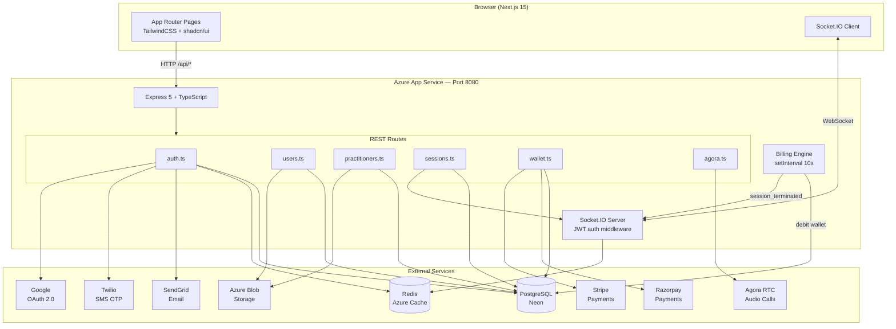
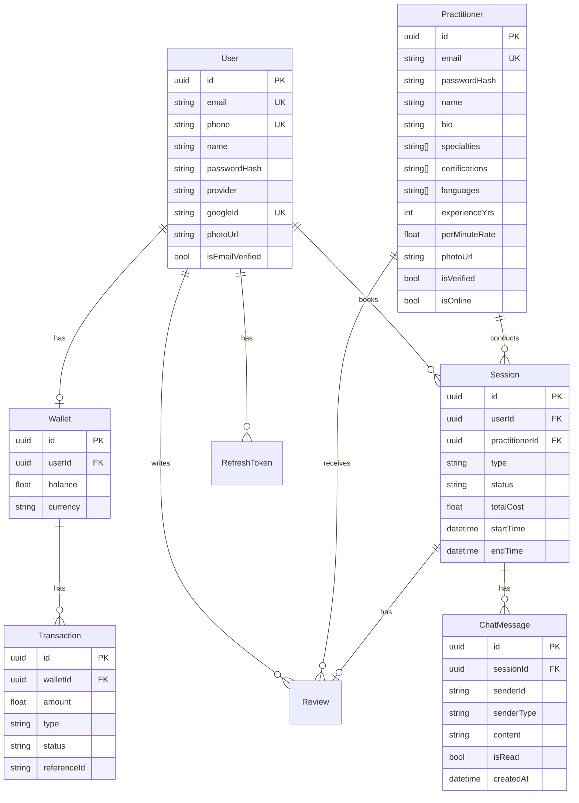

<div align="center">


<h1>🌿 HealConnect</h1>

<p style="font-size: 1.2em; color: #f59e0b;">Full-Stack Wellness Platform — Connect with Verified Energy Healers, Astrologers & Spiritual Experts Instantly</p>

<p align="center">
  
  
  
  
  
  
  
  
  
</p>

<p align="center">
  <a href="https://healconnect-backend-dqcsaqf4a6baffaz.centralindia-01.azurewebsites.net/health">
    
  </a>
  <a href="https://blue-plant-0d21bc900.6.azurestaticapps.net">
    
  </a>
</p>

</div>

---

## 📖 What is HealConnect?

HealConnect is a production-ready wellness platform that connects users with verified spiritual and wellness experts — astrologers, tarot readers, Vastu consultants, numerologists, and energy healers — for real-time chat and audio consultations.

**The core flow:**
- User registers → wallet auto-created → browses online experts → starts a chat/audio session → billed per minute from wallet
- Expert registers → goes online → receives session requests in real-time → joins chat → earns per session

---

## 💡 Key Features

### 👤 For Users
- **Browse Experts** — filter by specialty, language, rating, price, online status
- **Real-time Chat** — Socket.IO powered live chat with typing indicators & read receipts
- **Audio Calls** — Agora RTC powered voice consultations
- **Per-minute Billing** — wallet auto-debited every 60 seconds, session ends on low balance
- **Wallet System** — recharge via Razorpay or Stripe, full transaction history
- **Session History** — view past sessions, total spent, total minutes used
- **Google OAuth** — one-click sign-in with Google

### 🧘 For Experts
- **Dedicated Dashboard** — see active sessions, earnings, profile overview
- **Online/Offline Toggle** — go online to start receiving sessions, offline to stop
- **Real-time Notifications** — `new_session_request` socket event when user starts a session
- **Session History** — completed sessions with total earnings
- **Profile Management** — specialties, certifications, languages, per-minute rate

### ⚙️ Platform
- **JWT Auth** — access token (15min) + refresh token (7d) rotation
- **Redis Token Blacklist** — logout invalidates tokens instantly
- **Azure Blob Storage** — profile photo uploads
- **SendGrid Email** — email verification, password reset
- **Twilio SMS** — OTP verification
- **Rate Limiting** — per-IP limits on auth and general routes
- **Per-minute Billing Engine** — background worker bills every 60s, 60s grace period before termination

---

## 📁 Project Structure

```
HealConnect/
├── backend/                          # Node.js + Express 5 + TypeScript
│   ├── prisma/
│   │   ├── schema.prisma             # DB schema (User, Practitioner, Session, Wallet...)
│   │   └── prisma.config.ts
│   ├── src/
│   │   ├── index.ts                  # Server entry point — Port 8080
│   │   ├── lib/
│   │   │   ├── prisma.ts             # Prisma client with @prisma/adapter-pg
│   │   │   ├── jwt.ts                # Access + refresh token signing/verification
│   │   │   ├── redis.ts              # Redis client (supports Azure Cluster mode)
│   │   │   ├── azure.ts              # Azure Blob Storage upload/delete
│   │   │   ├── email.ts              # SendGrid email (verify, reset password)
│   │   │   ├── sms.ts                # Twilio SMS OTP
│   │   │   └── socket.ts             # Socket.IO server — full real-time chat logic
│   │   ├── middleware/
│   │   │   ├── auth.ts               # JWT Bearer token middleware
│   │   │   ├── rateLimiter.ts        # express-rate-limit (general, auth, email)
│   │   │   └── validate.ts           # express-validator error handler
│   │   ├── routes/
│   │   │   ├── auth.ts               # User + Expert register/login/OAuth/OTP
│   │   │   ├── users.ts              # User profile CRUD + photo upload
│   │   │   ├── practitioners.ts      # Expert profile CRUD + availability toggle
│   │   │   ├── sessions.ts           # Session create/end + history endpoints
│   │   │   ├── chat.ts               # Chat message history (REST)
│   │   │   ├── agora.ts              # Agora RTC token generation + feedback
│   │   │   └── wallet.ts             # Razorpay + Stripe recharge + webhooks
│   │   ├── services/
│   │   │   └── twilio.service.ts     # SMS OTP send/verify
│   │   └── workers/
│   │       └── billingEngine.ts      # Per-minute billing — runs every 10s
│   ├── .env.example
│   ├── package.json
│   └── tsconfig.json
│
└── web/                              # Next.js 15 App Router — Frontend
    ├── public/
    │   ├── logo.png
    │   ├── HealConnect.json          # Lottie animation (landing page)
    │   └── avatars/                  # Fallback practitioner avatars
    ├── src/
    │   ├── app/
    │   │   ├── page.tsx              # Landing page with Lottie animation
    │   │   ├── layout.tsx
    │   │   ├── globals.css
    │   │   ├── login/page.tsx        # Unified login — User tab + Expert tab
    │   │   ├── signup/page.tsx       # Unified signup — User tab + Expert tab
    │   │   ├── dashboard/
    │   │   │   ├── page.tsx          # User dashboard — experts, wallet, quick actions
    │   │   │   ├── profile/page.tsx  # User profile editor
    │   │   │   └── wallet/page.tsx   # Wallet balance + transaction history
    │   │   ├── practitioners/
    │   │   │   ├── page.tsx          # Browse all experts with filters
    │   │   │   └── [id]/page.tsx     # Expert detail page + reviews
    │   │   ├── expert/
    │   │   │   ├── login/page.tsx    # Expert login (redirects from /login Expert tab)
    │   │   │   └── dashboard/page.tsx # Expert panel — active sessions, earnings, profile
    │   │   ├── session/[sessionId]/page.tsx  # Live chat + audio call screen
    │   │   ├── verify-email/page.tsx
    │   │   ├── verify-otp/page.tsx
    │   │   ├── reset-password/page.tsx
    │   │   └── auth/google/callback/page.tsx
    │   ├── components/
    │   │   ├── ui/                   # shadcn/ui primitives (Button, Card, Badge...)
    │   │   ├── chat/
    │   │   │   ├── ChatWindow.tsx    # Full chat UI with messages, input, timer
    │   │   │   ├── MessageBubble.tsx
    │   │   │   ├── TypingIndicator.tsx
    │   │   │   ├── SessionTimerOverlay.tsx
    │   │   │   ├── EndSessionConfirmDialog.tsx
    │   │   │   └── AudioCallScreen.tsx
    │   │   └── wallet/
    │   │       └── RechargeModal.tsx # Razorpay + Stripe recharge modal
    │   ├── hooks/
    │   │   ├── useSessionChat.ts     # Socket.IO chat hook — messages, typing, billing
    │   │   └── useAgoraCall.ts       # Agora RTC audio call hook
    │   └── lib/
    │       ├── api.ts                # All REST API calls (typed)
    │       ├── socket.ts             # Socket.IO client singleton
    │       ├── i18n.ts               # EN/HI translations
    │       ├── lang-context.tsx      # Language context provider
    │       ├── razorpay.ts           # Razorpay checkout helper
    │       └── utils.ts              # cn(), getPractitionerAvatar()
    ├── next.config.mjs               # /api/* → backend rewrite proxy
    ├── tailwind.config.ts
    └── tsconfig.json
```

---

## 🏗️ System Architecture


```mermaid
graph TB
    subgraph Browser["Browser (Next.js 15)"]
        UI["App Router Pages\nTailwindCSS + shadcn/ui"]
        SOCK_C["Socket.IO Client"]
    end

    subgraph Backend["Azure App Service — Port 8080"]
        EXPRESS["Express 5 + TypeScript"]
        SOCK_S["Socket.IO Server\nJWT auth middleware"]
        BILLING["Billing Engine\nsetInterval 10s"]
        subgraph Routes["REST Routes"]
            AUTH["auth.ts"]
            USERS["users.ts"]
            PRACT["practitioners.ts"]
            SESS["sessions.ts"]
            WALLET["wallet.ts"]
            AGORA_R["agora.ts"]
        end
    end

    subgraph External["External Services"]
        PG[("PostgreSQL\nNeon")]
        REDIS[("Redis\nAzure Cache")]
        BLOB["Azure Blob\nStorage"]
        SENDGRID["SendGrid\nEmail"]
        TWILIO["Twilio\nSMS OTP"]
        GOOGLE["Google\nOAuth 2.0"]
        AGORA_SVC["Agora RTC\nAudio Calls"]
        RAZORPAY["Razorpay\nPayments"]
        STRIPE["Stripe\nPayments"]
    end

    UI -->|"HTTP /api/*"| EXPRESS
    SOCK_C <-->|"WebSocket"| SOCK_S
    EXPRESS --> Routes
    BILLING -->|"debit wallet"| PG
    BILLING -->|"session_terminated"| SOCK_S
    AUTH --> PG & REDIS & SENDGRID & TWILIO & GOOGLE
    USERS --> PG & BLOB
    PRACT --> PG & BLOB
    SESS --> PG & SOCK_S
    WALLET --> PG & RAZORPAY & STRIPE
    AGORA_R --> AGORA_SVC
    SOCK_S --> REDIS
```

---

## 🗄️ Database Schema


```mermaid
erDiagram
    User ||--o| Wallet : "has"
    User ||--o{ Session : "books"
    User ||--o{ Review : "writes"
    User ||--o{ RefreshToken : "has"
    Wallet ||--o{ Transaction : "has"
    Practitioner ||--o{ Session : "conducts"
    Practitioner ||--o{ Review : "receives"
    Session ||--o| Review : "has"
    Session ||--o{ ChatMessage : "has"

    User {
        uuid id PK
        string email UK
        string phone UK
        string name
        string passwordHash
        string provider
        string googleId UK
        string photoUrl
        bool isEmailVerified
    }

    Practitioner {
        uuid id PK
        string email UK
        string passwordHash
        string name
        string bio
        string[] specialties
        string[] certifications
        string[] languages
        int experienceYrs
        float perMinuteRate
        string photoUrl
        bool isVerified
        bool isOnline
    }

    Session {
        uuid id PK
        uuid userId FK
        uuid practitionerId FK
        string type
        string status
        float totalCost
        datetime startTime
        datetime endTime
    }

    Wallet {
        uuid id PK
        uuid userId FK
        float balance
        string currency
    }

    Transaction {
        uuid id PK
        uuid walletId FK
        float amount
        string type
        string status
        string referenceId
    }

    ChatMessage {
        uuid id PK
        uuid sessionId FK
        string senderId
        string senderType
        string content
        bool isRead
        datetime createdAt
    }
```

---

## 🌐 API Reference

### Auth — `/api/auth`

| Method | Endpoint | Auth | Description |
|--------|----------|------|-------------|
| POST | `/register` | ❌ | Register user — auto-creates Wallet |
| POST | `/login` | ❌ | Login — returns `accessToken` (15min) + `refreshToken` (7d) |
| POST | `/refresh` | ❌ | Rotate refresh token |
| POST | `/logout` | ✅ | Revoke refresh token + blacklist access token in Redis |
| POST | `/google` | ❌ | Google OAuth sign-in — auto-creates Wallet |
| GET | `/me` | ✅ | Get current authenticated user |
| GET | `/verify-email` | ❌ | Verify email via token link |
| POST | `/forgot-password` | ❌ | Send password reset email via SendGrid |
| POST | `/reset-password` | ❌ | Reset password via token |
| POST | `/send-otp` | ❌ | Send SMS OTP via Twilio |
| POST | `/verify-otp` | ❌ | Verify SMS OTP |
| POST | `/practitioner/register` | ❌ | Register expert account with passwordHash |
| POST | `/practitioner/login` | ❌ | Expert login — JWT includes `practitionerId` claim |

### Users — `/api/users`

| Method | Endpoint | Auth | Description |
|--------|----------|------|-------------|
| GET | `/me` | ✅ | Get full user profile |
| PATCH | `/me` | ✅ | Update profile fields |
| POST | `/me/photo` | ✅ | Upload photo to Azure Blob Storage |
| DELETE | `/me/photo` | ✅ | Delete photo from Azure Blob |
| DELETE | `/me` | ✅ | Delete account |

### Practitioners — `/api/practitioners`

| Method | Endpoint | Auth | Description |
|--------|----------|------|-------------|
| GET | `/` | ❌ | List experts — filter by specialty, language, rating, rate, online |
| GET | `/:id` | ❌ | Get expert profile + reviews |
| POST | `/` | ✅ | Create practitioner profile |
| PATCH | `/:id` | ✅ | Update profile |
| POST | `/:id/photo` | ✅ | Upload photo |
| PATCH | `/:id/availability` | ✅ | Toggle `isOnline` — broadcasts `practitioner_status` via Socket.IO |
| DELETE | `/:id` | ✅ | Delete practitioner |

### Sessions — `/api/sessions`

| Method | Endpoint | Auth | Description |
|--------|----------|------|-------------|
| POST | `/` | ✅ | Create session (CHAT/AUDIO/VIDEO) — checks wallet balance + expert online |
| GET | `/:id` | ✅ | Get session details with practitioner info |
| POST | `/:id/end` | ✅ | End session — emits `session_terminated` to room |
| GET | `/practitioner/active` | ✅ | Expert's currently active sessions |
| GET | `/practitioner/history` | ✅ | Expert's completed sessions + total earnings |
| GET | `/user/history` | ✅ | User's completed sessions + total spent + total minutes |

### Wallet — `/api/wallet`

| Method | Endpoint | Auth | Description |
|--------|----------|------|-------------|
| GET | `/` | ✅ | Get balance + transaction history |
| POST | `/recharge` | ✅ | Create Razorpay order |
| POST | `/recharge/stripe` | ✅ | Create Stripe checkout session |
| POST | `/webhook` | ❌ | Razorpay webhook — credits wallet on payment success |
| POST | `/stripe-webhook` | ❌ | Stripe webhook — credits wallet on payment success |

### Agora — `/api/agora`

| Method | Endpoint | Auth | Description |
|--------|----------|------|-------------|
| POST | `/token` | ✅ | Generate Agora RTC token for a session |
| GET | `/channel/:sessionId` | ✅ | Get channel info + session type |
| POST | `/feedback` | ✅ | Submit call quality feedback |

---

## 🔐 Authentication Flow

```
── User ──────────────────────────────────────────────────────────
POST /api/auth/register  →  creates User + Wallet
POST /api/auth/login     →  { accessToken (15min), refreshToken (7d) }
POST /api/auth/google    →  Google OAuth → same response

── Expert ────────────────────────────────────────────────────────
POST /api/auth/practitioner/register  →  creates Practitioner with passwordHash
POST /api/auth/practitioner/login     →  JWT payload includes { userId, practitionerId }

── Every Request ─────────────────────────────────────────────────
Authorization: Bearer <accessToken>

── Token Refresh ─────────────────────────────────────────────────
POST /api/auth/refresh { refreshToken }
→ old token revoked in DB
→ new { accessToken, refreshToken } returned

── Logout ────────────────────────────────────────────────────────
POST /api/auth/logout
→ refreshToken revoked in DB
→ accessToken blacklisted in Redis until natural expiry
```

---

## ⚡ Real-time Events (Socket.IO)

Socket connects to backend directly (not via Next.js proxy). JWT token passed in `socket.handshake.auth.token`.

| Event | Direction | Trigger | Description |
|-------|-----------|---------|-------------|
| `join_room` | Client → Server | User/Expert opens session page | Joins `room:<sessionId>`, receives message history |
| `joined_room` | Server → Client | After join verified | Confirms join, starts session timer on client |
| `peer_joined` | Server → Room | Other party joins | Notifies the other participant |
| `send_message` | Client → Server | User types + sends | Saves to DB, broadcasts to room |
| `new_message` | Server → Room | On `send_message` | Delivers message to both parties |
| `message_history` | Server → Client | On `join_room` | Last 100 messages sent on join |
| `typing_start` | Client → Server | User starts typing | — |
| `typing_stop` | Client → Server | User stops typing | — |
| `typing_update` | Server → Room | On typing events | `{ userId, isTyping }` |
| `message_read` | Client → Server | Message visible | Updates `isRead` in DB |
| `receipt_update` | Server → Room | On `message_read` | `{ messageId, readAt }` |
| `new_session_request` | Server → Expert | User creates session | Sent to `practitioner_<id>` room |
| `session_terminated` | Server → Room | Session ended / balance out | Disconnects both parties |
| `low_balance` | Server → Room | Billing engine — balance < rate | Warning before termination |
| `practitioner_status` | Server → All | Expert goes online/offline | `{ practitionerId, isOnline }` — updates cards in real-time |

---

## 💳 Billing Engine

Background worker in `src/workers/billingEngine.ts` — runs every **10 seconds**, bills every **60 seconds**.

```
Every 60s per ACTIVE session:
  wallet.balance >= perMinuteRate  →  debit wallet, increment session.totalCost
  wallet.balance < perMinuteRate   →  start 60s grace period, emit low_balance
  grace period expired             →  terminate session, emit session_terminated
```

Uses Redis distributed lock (`lock:billing:<sessionId>`) to prevent double-billing on multiple instances.

---

## 👤 User vs Expert

| Feature | User | Expert |
|---------|------|--------|
| Login | `/login` → User tab | `/login` → Expert tab |
| Dashboard | `/dashboard` | `/expert/dashboard` |
| Wallet | ✅ Auto-created on register | ❌ |
| Billing | Debited per minute | Credited per session |
| Session history | `/api/sessions/user/history` | `/api/sessions/practitioner/history` |
| Socket identity | `userId` in JWT | `practitionerId` in JWT |
| Online status | N/A | Auto online on socket connect, offline on disconnect |

---

## ⚡ Rate Limiting

| Limiter | Applied To | Limit |
|---------|-----------|-------|
| `generalLimiter` | All routes | 100 req / 15 min per IP |
| `authLimiter` | `/register`, `/login`, `/google`, `/practitioner/*` | 10 req / 15 min (100 in dev) |
| `emailLimiter` | `/forgot-password`, `/resend-verification` | 5 req / hr (50 in dev) |

---

## 🚀 Quick Start

### Backend
```bash
cd backend
npm install
cp .env.example .env
# Fill in: DATABASE_URL, REDIS_URL, JWT_ACCESS_SECRET, JWT_REFRESH_SECRET,
#          SENDGRID_API_KEY, TWILIO_*, AZURE_*, GOOGLE_CLIENT_ID,
#          RAZORPAY_*, STRIPE_*, AGORA_APP_ID, AGORA_APP_CERTIFICATE
npx prisma generate
npx prisma db push
npm run dev            # → http://localhost:8080
```

### Frontend
```bash
cd web
npm install
# create web/.env:
NEXT_PUBLIC_API_URL=http://localhost:8080
NEXT_PUBLIC_BACKEND_URL=http://localhost:8080
NEXT_PUBLIC_GOOGLE_CLIENT_ID=your_google_client_id
npm run dev            # → http://localhost:3000
```

---

## 🛠️ Tech Stack

| Layer | Technology | Purpose |
|-------|-----------|---------|
| Frontend Framework | Next.js 15 (App Router) | SSR + client pages |
| Language | TypeScript (strict) | Both frontend + backend |
| Styling | TailwindCSS + shadcn/ui | UI components |
| Animation | lottie-react | Landing page animation |
| i18n | Custom lang-context | EN/HI language toggle |
| Backend | Express 5 + Node.js 20+ | REST API server |
| ORM | Prisma 7 + `@prisma/adapter-pg` | Type-safe DB queries |
| Database | PostgreSQL 15 (Neon) | Primary data store |
| Cache / Blacklist | Redis (Azure Cache) | Token blacklist + billing locks |
| Real-time | Socket.IO 4 | Chat, typing, billing events |
| Auth | JWT + bcrypt + Google OAuth 2.0 | User + Expert auth |
| Storage | Azure Blob Storage | Profile photo uploads |
| Email | SendGrid | Email verification + password reset |
| SMS | Twilio | OTP verification |
| Audio Calls | Agora RTC | Real-time voice consultations |
| Payments | Razorpay + Stripe | Wallet recharge |
| Billing | Custom per-minute engine | Background billing worker |
| CI/CD | GitHub Actions | Auto-deploy to Azure on push to `main` |
| Hosting | Azure App Service + Azure Static Web Apps | Backend + Frontend |

---

## ⚠️ Known Issues & Notes

- Socket.IO connects directly to backend URL — not via Next.js `/api` proxy (WebSocket upgrade not supported in rewrites)
- Azure Redis Cluster — `EVALSHA` (Lua scripts) not supported; `rate-limit-redis` removed, using in-memory store for rate limiting
- Practitioners cannot book sessions — enforced at API level (`practitionerId` in JWT blocks session creation)
- Wallet auto-created on user register (email + Google OAuth) — experts have no wallet
- Local dev: use incognito window for user + normal window for expert (separate `localStorage` on same port)
- `ChatMessage` table requires `npx prisma db push` — not yet in all environments

---

## 📄 License

This project is licensed under the [MIT License](LICENSE).

---

<div align="center">

**🌿 Built with ❤️ by Abhishek Giri**

<a href="https://www.linkedin.com/in/abhishekgiri04/">
  
</a>
<a href="https://github.com/abhishekgiri04">
  
</a>
<a href="mailto:abhishekgiri1978@gmail.com">
  
</a>

**© 2026 Abhishek Giri | HealConnect — Wellness Platform**

</div>
