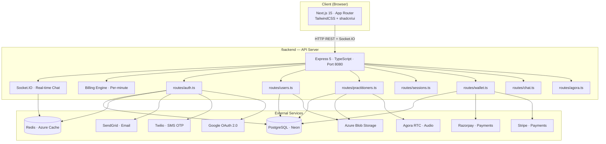
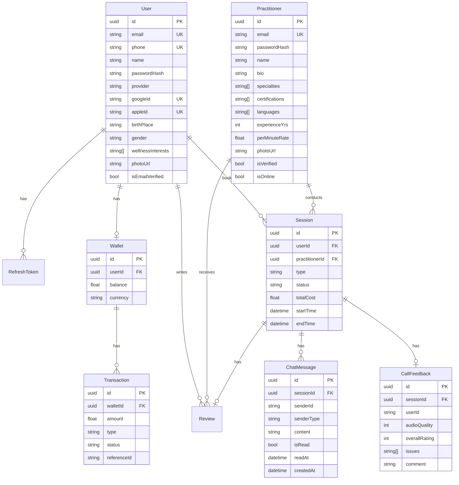

<div align="center">


<h1>🌿 HealConnect — Wellness Platform</h1>

<p align="center">


</p>

> A production-ready full-stack wellness platform connecting users with verified energy healers, Vastu experts, numerologists, and tarot readers — instantly.

</div>

---

## 📁 Project Structure

```
HealConnect/
├── backend/                          # Node.js + Express 5 + Prisma API
│   ├── prisma/
│   │   ├── schema.prisma
│   │   └── prisma.config.ts
│   ├── src/
│   │   ├── index.ts                  # Entry point (Port 8080)
│   │   ├── lib/
│   │   │   ├── prisma.ts
│   │   │   ├── jwt.ts
│   │   │   ├── redis.ts
│   │   │   ├── azure.ts
│   │   │   ├── email.ts
│   │   │   ├── sms.ts
│   │   │   └── socket.ts             # Socket.IO server
│   │   ├── middleware/
│   │   │   ├── auth.ts
│   │   │   ├── rateLimiter.ts
│   │   │   └── validate.ts
│   │   ├── routes/
│   │   │   ├── auth.ts               # User + Practitioner auth
│   │   │   ├── users.ts
│   │   │   ├── practitioners.ts
│   │   │   ├── sessions.ts           # + /practitioner/history, /user/history
│   │   │   ├── chat.ts
│   │   │   ├── agora.ts
│   │   │   └── wallet.ts             # Razorpay + Stripe
│   │   ├── services/
│   │   │   └── twilio.service.ts
│   │   └── workers/
│   │       └── billingEngine.ts      # Per-minute billing
│   ├── .env.example
│   ├── package.json
│   └── tsconfig.json
├── web/                              # Next.js 15 App Router Frontend
│   ├── public/
│   │   ├── logo.png
│   │   ├── HealConnect.json          # Lottie animation
│   │   └── avatars/                  # Practitioner avatars
│   ├── src/
│   │   ├── app/
│   │   │   ├── page.tsx              # Landing page
│   │   │   ├── layout.tsx
│   │   │   ├── globals.css
│   │   │   ├── login/                # Unified login (User + Expert toggle)
│   │   │   ├── signup/               # Unified signup (User + Expert toggle)
│   │   │   ├── dashboard/
│   │   │   │   ├── page.tsx
│   │   │   │   ├── profile/
│   │   │   │   └── wallet/
│   │   │   ├── practitioners/
│   │   │   │   ├── page.tsx
│   │   │   │   └── [id]/
│   │   │   ├── expert/
│   │   │   │   ├── dashboard/        # Expert dashboard (sessions + earnings)
│   │   │   │   ├── profile/          # Expert profile editor
│   │   │   │   └── login/            # Redirects to /login?role=expert
│   │   │   ├── session/[sessionId]/  # Real-time chat + audio call
│   │   │   ├── verify-email/
│   │   │   ├── verify-otp/
│   │   │   ├── reset-password/
│   │   │   └── auth/google/callback/
│   │   ├── components/
│   │   │   ├── ui/                   # shadcn/ui primitives
│   │   │   ├── chat/                 # ChatWindow, AudioCallScreen, etc.
│   │   │   ├── wallet/               # RechargeModal
│   │   │   ├── navbar.tsx
│   │   │   ├── hero-animation.tsx
│   │   │   └── theme-toggle.tsx
│   │   ├── hooks/
│   │   │   ├── useAgoraCall.ts
│   │   │   └── useSessionChat.ts
│   │   └── lib/
│   │       ├── api.ts                # All API calls incl. session history
│   │       ├── i18n.ts
│   │       ├── lang-context.tsx
│   │       ├── socket.ts             # Socket.IO client (auto localhost/prod)
│   │       ├── razorpay.ts
│   │       └── utils.ts
│   ├── next.config.mjs
│   ├── tailwind.config.ts
│   └── tsconfig.json
├── docs/
│   ├── logo.png
│   └── tech_stack_review.md
├── LICENSE
└── README.md
```

---

## 🛠️ System Architecture


```mermaid
graph TB
    subgraph Client["Client (Browser)"]
        WEB["Next.js 15 · App Router\nTailwindCSS + shadcn/ui"]
    end

    subgraph Backend["/backend — API Server"]
        EXPRESS["Express 5 · TypeScript · Port 8080"]
        SOCKET["Socket.IO · Real-time Chat"]
        BILLING["Billing Engine · Per-minute"]
        AUTH["routes/auth.ts"]
        USERS["routes/users.ts"]
        PRACTITIONERS["routes/practitioners.ts"]
        SESSIONS["routes/sessions.ts"]
        WALLET["routes/wallet.ts"]
        CHAT["routes/chat.ts"]
        AGORA["routes/agora.ts"]
    end

    subgraph Services["External Services"]
        PG[("PostgreSQL · Neon")]
        REDIS[("Redis · Azure Cache")]
        AZURE["Azure Blob Storage"]
        SENDGRID["SendGrid · Email"]
        TWILIO["Twilio · SMS OTP"]
        GOOGLE["Google OAuth 2.0"]
        AGORASVC["Agora RTC · Audio"]
        RAZORPAY["Razorpay · Payments"]
        STRIPE["Stripe · Payments"]
    end

    WEB -->|"HTTP REST + Socket.IO"| EXPRESS
    EXPRESS --> SOCKET
    EXPRESS --> BILLING
    EXPRESS --> AUTH & USERS & PRACTITIONERS
    EXPRESS --> SESSIONS & WALLET & CHAT & AGORA
    AUTH --> PG & REDIS & SENDGRID & TWILIO & GOOGLE
    USERS --> PG & AZURE
    PRACTITIONERS --> PG & AZURE & AGORASVC
    WALLET --> PG & RAZORPAY & STRIPE
    SOCKET --> REDIS
```

---

## 🗄️ Database Schema


```mermaid
erDiagram
    User ||--o{ RefreshToken : "has"
    User ||--o| Wallet : "has"
    User ||--o{ Session : "books"
    User ||--o{ Review : "writes"
    Wallet ||--o{ Transaction : "has"
    Practitioner ||--o{ Session : "conducts"
    Practitioner ||--o{ Review : "receives"
    Session ||--o| Review : "has"
    Session ||--o{ ChatMessage : "has"
    Session ||--o| CallFeedback : "has"

    User {
        uuid id PK
        string email UK
        string phone UK
        string name
        string passwordHash
        string provider
        string googleId UK
        string appleId UK
        string birthPlace
        string gender
        string[] wellnessInterests
        string photoUrl
        bool isEmailVerified
    }

    Practitioner {
        uuid id PK
        string email UK
        string passwordHash
        string name
        string bio
        string[] specialties
        string[] certifications
        string[] languages
        int experienceYrs
        float perMinuteRate
        string photoUrl
        bool isVerified
        bool isOnline
    }

    Session {
        uuid id PK
        uuid userId FK
        uuid practitionerId FK
        string type
        string status
        float totalCost
        datetime startTime
        datetime endTime
    }

    Wallet {
        uuid id PK
        uuid userId FK
        float balance
        string currency
    }

    Transaction {
        uuid id PK
        uuid walletId FK
        float amount
        string type
        string status
        string referenceId
    }

    ChatMessage {
        uuid id PK
        uuid sessionId FK
        string senderId
        string senderType
        string content
        bool isRead
        datetime readAt
        datetime createdAt
    }

    CallFeedback {
        uuid id PK
        uuid sessionId FK
        string userId
        int audioQuality
        int overallRating
        string[] issues
        string comment
    }
```

---

## 🌐 API Reference

### Auth — `/api/auth`
| Method | Endpoint | Auth | Description |
|---|---|---|---|
| POST | `/register` | ❌ | Register user (auto-creates wallet) |
| POST | `/login` | ❌ | Login, returns access + refresh tokens |
| POST | `/refresh` | ❌ | Rotate refresh token |
| POST | `/logout` | ✅ | Revoke tokens, blacklist access token |
| POST | `/google` | ❌ | Google OAuth sign-in (auto-creates wallet) |
| GET | `/me` | ✅ | Get current authenticated user |
| GET | `/verify-email` | ❌ | Verify email via token |
| POST | `/forgot-password` | ❌ | Send password reset email |
| POST | `/reset-password` | ❌ | Reset password via token |
| POST | `/send-otp` | ❌ | Send SMS OTP via Twilio |
| POST | `/verify-otp` | ❌ | Verify SMS OTP |
| POST | `/practitioner/register` | ❌ | Register expert account |
| POST | `/practitioner/login` | ❌ | Expert login |

### Users — `/api/users`
| Method | Endpoint | Description |
|---|---|---|
| GET | `/me` | Get full user profile |
| PATCH | `/me` | Update profile |
| POST | `/me/photo` | Upload photo to Azure Blob |
| DELETE | `/me/photo` | Delete photo |
| DELETE | `/me` | Delete account |

### Practitioners — `/api/practitioners`
| Method | Endpoint | Auth | Description |
|---|---|---|---|
| GET | `/` | ❌ | List with filters (search, specialty, language, rate) |
| GET | `/:id` | ❌ | Get profile + reviews |
| POST | `/` | ✅ | Create profile |
| PATCH | `/:id` | ✅ | Update profile |
| POST | `/:id/photo` | ✅ | Upload photo |
| PATCH | `/:id/availability` | ✅ | Toggle online/offline |
| DELETE | `/:id` | ✅ | Delete |

### Sessions — `/api/sessions`
| Method | Endpoint | Auth | Description |
|---|---|---|---|
| POST | `/` | ✅ | Create session (CHAT/AUDIO/VIDEO) |
| GET | `/:id` | ✅ | Get session details |
| POST | `/:id/end` | ✅ | End session |
| GET | `/practitioner/active` | ✅ | Expert's active sessions |
| GET | `/practitioner/history` | ✅ | Expert's session history + total earnings |
| GET | `/user/history` | ✅ | User's session history + total spent + minutes |

### Wallet — `/api/wallet`
| Method | Endpoint | Description |
|---|---|---|
| GET | `/` | Get balance + transactions |
| POST | `/recharge` | Recharge via Razorpay |
| POST | `/recharge/stripe` | Recharge via Stripe |
| POST | `/webhook` | Razorpay webhook |
| POST | `/stripe-webhook` | Stripe webhook |

### Agora — `/api/agora`
| Method | Endpoint | Description |
|---|---|---|
| POST | `/token` | Get Agora RTC token |
| GET | `/channel/:sessionId` | Get channel info |
| POST | `/feedback` | Submit call feedback |

---

## 🔐 Authentication Flow

```
# User
POST /api/auth/register  → auto-creates Wallet
POST /api/auth/login     → returns { accessToken (15min), refreshToken (7d) }

# Expert
POST /api/auth/practitioner/register
POST /api/auth/practitioner/login    → JWT includes practitionerId claim

Every request → Authorization: Bearer <accessToken>

When accessToken expires:
  POST /api/auth/refresh { refreshToken }
  → returns new { accessToken, refreshToken }

POST /api/auth/logout
  → refresh token revoked in DB
  → access token blacklisted in Redis
```

---

## 👤 User vs Expert Roles

| Feature | User | Expert |
|---|---|---|
| Login page | `/login` (User tab) | `/login` (Expert tab) |
| Dashboard | `/dashboard` | `/expert/dashboard` |
| Profile | `/dashboard/profile` | `/expert/profile` |
| Session history | `/api/sessions/user/history` | `/api/sessions/practitioner/history` |
| Wallet | Yes (auto-created on register) | No |
| Billing | Debited per minute | Credited per session |

---

## ⚡ Real-time Events (Socket.IO)

| Event | Direction | Description |
|---|---|---|
| `join_room` | Client → Server | Join a session room |
| `joined_room` | Server → Client | Confirmed join |
| `send_message` | Client → Server | Send chat message |
| `new_message` | Server → Client | Broadcast message |
| `message_history` | Server → Client | Past messages on join |
| `typing_start/stop` | Client → Server | Typing indicator |
| `typing_update` | Server → Client | Typing broadcast |
| `new_session_request` | Server → Expert | New session created |
| `session_terminated` | Server → Client | Session ended |
| `low_balance` | Server → Client | Wallet balance warning |
| `practitioner_status` | Server → All | Expert online/offline |

---

## ⚡ Rate Limiting

| Limiter | Routes | Limit |
|---|---|---|
| `generalLimiter` | All routes | 100 req / 15 min |
| `authLimiter` | `/register`, `/login`, `/google` | 10 req / 15 min (prod) |
| `emailLimiter` | `/forgot-password`, `/resend-verification` | 5 req / hr (prod) |

---

## 🚀 Quick Start

### Backend
```bash
cd backend
npm install
cp .env.example .env   # fill in your values
npx prisma generate
npx prisma db push
npm run dev            # → http://localhost:8080
```

### Frontend
```bash
cd web
npm install
# create web/.env
NEXT_PUBLIC_API_URL=http://localhost:8080
NEXT_PUBLIC_GOOGLE_CLIENT_ID=your_google_client_id
npm run dev            # → http://localhost:3000
```

---

## 🛠️ Tech Stack

| Layer | Technology |
|---|---|
| Framework | Next.js 15 (App Router) |
| Language | TypeScript (strict) |
| Styling | TailwindCSS + shadcn/ui |
| Animation | lottie-react |
| i18n | Custom lang-context (EN/HI) |
| Backend | Express 5 + Node.js 20+ |
| ORM | Prisma 7 + `@prisma/adapter-pg` |
| Database | PostgreSQL 15 (Neon) |
| Cache | Redis (Azure Cache) |
| Real-time | Socket.IO 4 |
| Auth | JWT + bcrypt + Google OAuth |
| Storage | Azure Blob Storage |
| Email | SendGrid |
| Calls | Agora RTC (audio) |
| Payments | Razorpay + Stripe |
| Billing | Custom per-minute billing engine |

---

## ⚠️ Known Issues & Notes

- Socket.IO connects directly to backend (`NEXT_PUBLIC_API_URL`), not via Next.js proxy
- Redis Cluster (Azure) — `EVALSHA` not supported, use `sendCommand` wrapper
- Practitioners cannot book sessions (enforced at API level)
- Wallet auto-created on user register (email + Google OAuth)
- Local testing: use incognito for user + normal browser for expert (same localStorage port)

---

## 📄 License

This project is licensed under the [MIT License](LICENSE).

**© 2026 Abhishek Giri | HealConnect**
